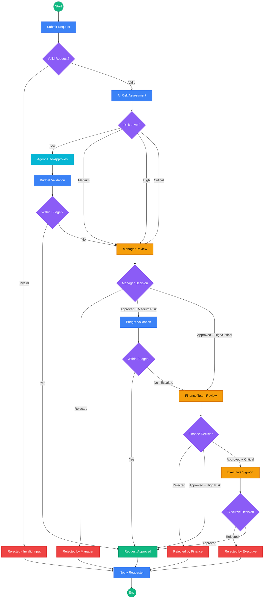

# Assignment 5: Financial Approval System with Human-in-the-Loop

**UCLA Extension — Agentic AI Course**

## Overview

| Part | Focus | Points |
|------|-------|--------|
| **Part 1** | LangGraph Workflow + 3 Interrupts | 35 |
| **Part 2** | Safety Guardrails | 20 |
| **Part 3** | CopilotKit Frontend (GIVEN) | — |
| **Part 4** | LangSmith Tracing + Evaluation | 20 |
| **Bonus** | Advanced Features | +25 |
| **Total** | | **75 + 25 bonus** |

## What You'll Build

A production-grade Financial Approval System that demonstrates:
- **LangGraph** multi-stage approval workflow with 3 human-in-the-loop interrupt points
- **CopilotKit** frontend for real-time interaction with the approval agent
- **Safety guardrails** for input validation and PII filtering
- **LangSmith** integration for tracing and evaluation

## Architecture

```mermaid
flowchart LR
    classDef frontend fill:#3B82F6,color:#fff
    classDef proxy fill:#6366F1,color:#fff
    classDef backend fill:#10B981,color:#fff
    classDef interrupt fill:#F59E0B,color:#000
    classDef reject fill:#EF4444,color:#fff
    classDef db fill:#8B5CF6,color:#fff
    classDef auto fill:#06B6D4,color:#fff

    U((User)) --> Chat[CopilotChat]:::frontend
    U --> Form[RequestForm]:::frontend
    Chat --> Route["/api/copilotkit"]:::proxy
    Form --> Route
    Route --> AGUI["FastAPI + AG-UI"]:::backend
    AGUI --> G1[submit_request]:::backend
    G1 --> G2[assess_risk LLM]:::backend
    G2 -->|Low| BUD[validate_budget]:::auto
    G2 -->|Med/High/Crit| G3["manager_review INTERRUPT"]:::interrupt
    BUD -->|Within budget| G7[process_request]:::backend
    BUD -->|Over budget| G3
    G3 -->|Rejected| REJ[handle_rejection]:::reject
    G3 -->|Med approved| BUD
    G3 -->|High/Crit approved| G5["finance_review INTERRUPT"]:::interrupt
    G5 -->|Rejected| REJ
    G5 -->|High approved| G7
    G5 -->|Crit approved| G6["final_signoff INTERRUPT"]:::interrupt
    G6 -->|Approved| G7
    G6 -->|Rejected| REJ
    G3 -.->|"Pauses graph"| Modal["ApprovalPanel Modal"]:::frontend
    Modal -.->|"resolve(decision)"| G3
    AGUI --> DB[(SQLite Checkpoints)]:::db
```



**Key components:**
- **Blue** = Frontend (Next.js + CopilotKit)
- **Green** = Backend nodes (LangGraph StateGraph)
- **Cyan** = Auto-approve path (low-risk within-budget requests skip human review)
- **Yellow** = Human-in-the-loop interrupt points (graph pauses, modal appears)
- **Red** = Rejection path
- **Purple** = Persistence (SQLite checkpointer for interrupt/resume)

## Business Flow

The approval path escalates based on the AI risk assessment — low-risk requests are auto-approved by the agent, while higher-risk requests require progressively more human reviewers.



**Escalation rules:**

| Risk Level | Approval Path | Human Reviews |
|---|---|---|
| **Low** | Agent auto-approves → budget check → done | 0 (unless over budget → escalates to manager) |
| **Medium** | Manager review → budget check → done | 1 (unless over budget → escalates to finance) |
| **High** | Manager → Finance review → done | 2 |
| **Critical** | Manager → Finance → Executive sign-off | 3 |

## Prerequisites

- Python 3.11+
- Node.js 18+
- OpenAI API key (or Google Gemini API key)
- LangSmith API key (for Part 4)

## Setup

### 1. Backend

```bash
# Create conda environment
conda create -n hitl-agent python=3.11 -y
conda activate hitl-agent

# Install dependencies
cd assignment-5
pip install -r backend/requirements.txt

# Configure environment
cp .env.example .env
# Edit .env with your API keys
```

### 2. Frontend

```bash
cd frontend
npm install

# Configure environment
cp .env.local.example .env.local
```

### 3. Run the Application

You need **two terminals** — one for the backend (Python) and one for the frontend (Node.js).

**Terminal 1: Start the Backend**
```bash
cd assignment-5
conda activate hitl-agent
python -m backend.server
# Backend starts at http://localhost:8000
# Health check: http://localhost:8000/health
```

**Terminal 2: Start the Frontend**
```bash
cd assignment-5/frontend
npm run dev
# Frontend starts at http://localhost:3000
```

Open **http://localhost:3000** in your browser to interact with the Financial Approval System.

> **Note:** Before you implement your graph, the server automatically loads a **demo graph** (`backend/agent/demo_graph.py`) so you can see the frontend and HITL interrupt flow in action. The demo has a single manager-review interrupt — submit a request and you'll see the approval modal appear. Once you implement `create_approval_graph()`, the server switches to your full graph automatically.

### How it Works End-to-End

1. **Submit a request** via the chat or the form on the right sidebar
2. The backend LangGraph workflow processes the request through these stages:
   - **Submit & Validate** → checks amount, department, injection patterns
   - **Risk Assessment** → LLM evaluates risk level (low/medium/high/critical)
   - **Manager Review** → workflow **pauses** (interrupt) → **Approval Panel appears** in browser
   - **Budget Validation** → checks against department budget limits
   - **Finance Review** → workflow **pauses** again → **Approval Panel appears** with budget info
   - **Final Sign-off** → workflow **pauses** one last time → **Approval Panel shows full decision chain**
   - **Process/Reject** → final result based on all approval decisions
3. At each interrupt, the **Approval Panel modal** pops up showing request details
4. Click **Approve** or **Reject** with comments to resume the workflow
5. The graph continues to the next stage or terminates with rejection

## Project Structure

```
assignment-5/
├── backend/
│   ├── server.py                    # FastAPI + CopilotKit endpoint (GIVEN)
│   ├── config.py                    # Environment & LLM factory (GIVEN)
│   ├── models.py                    # Pydantic schemas (GIVEN)
│   ├── seed_data.py                 # Sample requests (GIVEN)
│   │
│   ├── agent/
│   │   ├── state.py                 # ApprovalState TypedDict (GIVEN)
│   │   ├── graph.py                 # ★ StateGraph assembly (TODO)
│   │   ├── nodes.py                 # ★ 8 nodes + 4 routers (TODO)
│   │   └── checkpointer.py         # SQLite checkpointer (GIVEN)
│   │
│   ├── guardrails/
│   │   ├── input_validator.py       # ★ Input validation (TODO)
│   │   └── output_filter.py        # ★ PII filtering (TODO)
│   │
│   └── evaluation/
│       ├── dataset.py               # 10 eval test cases (GIVEN)
│       ├── evaluators.py            # ★ LangSmith evaluators (TODO)
│       └── run_eval.py              # Evaluation runner (GIVEN)
│
├── frontend/
│   └── src/
│       ├── app/
│       │   ├── layout.tsx           # CopilotKit provider (GIVEN)
│       │   ├── page.tsx             # Main page with CopilotChat (GIVEN)
│       │   └── api/copilotkit/
│       │       └── route.ts         # API route (GIVEN)
│       │
│       └── components/
│           ├── ApprovalPanel.tsx     # Interrupt approval UI (GIVEN)
│           ├── RequestForm.tsx       # Request form (GIVEN)
│           ├── WorkflowStatus.tsx    # Step indicator (GIVEN)
│           └── RequestHistory.tsx    # Past requests (GIVEN)
│
└── tests/                           # Test harnesses (GIVEN)
```

**★ = Files you need to implement** (5 files total)

## Part 1: LangGraph Workflow + Interrupts (35 points)

### Files to Implement
- `backend/agent/nodes.py` — 8 node functions + 4 routing functions
- `backend/agent/graph.py` — StateGraph assembly

### Workflow Graph

```
START → submit_request → [valid?]
                            ├─ No → handle_rejection → END
                            └─ Yes → assess_risk → manager_review (INTERRUPT)
                                                        ├─ Rejected → handle_rejection → END
                                                        └─ Approved → validate_budget → finance_review (INTERRUPT)
                                                                                            ├─ Rejected → handle_rejection → END
                                                                                            └─ Approved → final_signoff (INTERRUPT)
                                                                                                              ├─ Rejected → handle_rejection → END
                                                                                                              └─ Approved → process_request → END
```

### Key Concepts
- **interrupt()**: Pauses the graph and sends data to the frontend for human review
- **Command(resume=...)**: Frontend sends the human's decision back to resume the graph
- **SqliteSaver**: Persists graph state so interrupted workflows survive server restarts
- **Conditional edges**: Route the workflow based on approval/rejection decisions

### Point Breakdown
| Function | Points | Description |
|----------|--------|-------------|
| `submit_request` | 5 | Validate and submit the request |
| `assess_risk` | 5 | LLM-based risk assessment |
| `manager_review` | 5 | Manager interrupt + decision handling |
| `validate_budget` | 3 | Department budget check |
| `finance_review` | 5 | Finance team interrupt |
| `final_signoff` | 5 | Executive interrupt |
| `process_request` | 3 | Process approved request |
| `handle_rejection` | 4 | Handle rejected request |
| 4 routing functions | 1 each | Conditional routing |
| `create_approval_graph` | 10 | Wire everything together |

## Part 2: Safety Guardrails (20 points)

### Files to Implement
- `backend/guardrails/input_validator.py` — Input validation (10 points)
- `backend/guardrails/output_filter.py` — Output filtering (10 points)

### Input Validation
- Reject negative amounts and amounts exceeding budget ceiling
- Reject invalid departments
- Block SQL injection and XSS patterns
- Enforce field length limits

### Output Filtering
- Mask SSN patterns (XXX-XX-XXXX)
- Mask credit card numbers
- Redact email addresses
- Mask phone numbers
- Mask financial details (dollar amounts, account numbers)

## Part 3: CopilotKit Frontend (GIVEN)

The frontend is fully implemented for you. Study the code to understand how CopilotKit integrates with LangGraph for human-in-the-loop approvals.

### Key Files
| File | Purpose |
|------|---------|
| `frontend/src/app/layout.tsx` | Wraps the app in `<CopilotKit>` provider pointing to the backend |
| `frontend/src/app/page.tsx` | Two-column layout: CopilotChat (left) + sidebar controls (right) |
| `frontend/src/components/ApprovalPanel.tsx` | Modal overlay for HITL approval using `useLangGraphInterrupt` |
| `frontend/src/components/RequestForm.tsx` | Form to submit financial requests via chat |
| `frontend/src/components/WorkflowStatus.tsx` | Visual step-by-step progress indicator |
| `frontend/src/components/RequestHistory.tsx` | List of past approval requests |
| `frontend/src/app/api/copilotkit/route.ts` | API route proxy using `LangGraphHttpAgent` |

### How HITL Approvals Work (Frontend ↔ Backend)

```
Backend (LangGraph)                    Frontend (CopilotKit)
──────────────────                    ─────────────────────
manager_review node
  │
  ├─ interrupt({type, title,          useLangGraphInterrupt({ render })
  │    amount, risk_level, ...})  ──► render callback fires with event & resolve
  │                                   ApprovalModal appears (fixed overlay)
  │                                   User sees request details
  │                                   User clicks Approve/Reject
  │                                        │
  ◄─ Command(resume={approved,        resolve(JSON.stringify({approved,
  │    comments})                       comments})) sends decision back
  │
  ├─ Resumes execution with
  │   human's decision
  ▼
validate_budget node (continues)      Modal closes, chat updates
```

### Key Concepts
- **CopilotChat**: Chat interface connecting to the LangGraph agent via CopilotKit
- **useLangGraphInterrupt**: React hook that registers a `render` callback — when the graph calls `interrupt()`, the callback receives the event data and a `resolve()` function
- **resolve()**: Sends the human's decision as a JSON string (`JSON.stringify({approved, comments})`) back to the LangGraph workflow to resume execution
- **SqliteSaver checkpointer**: Persists the paused graph state so the workflow survives page refreshes

### Testing the Frontend
```bash
cd assignment-5/frontend
npm install          # Install dependencies (first time only)
npm run dev          # Start dev server at http://localhost:3000
```

The frontend needs the backend running (`python -m backend.server`) to function. Without the backend, you'll see the UI layout but chat won't work.

## Part 4: LangSmith Tracing + Evaluation (20 points)

### Files to Implement
- `backend/evaluation/evaluators.py` — Custom evaluators (20 points)

### Evaluators
1. **Risk Accuracy Evaluator** (10 points): Compares predicted risk level to expected
   - Exact match → score 1.0
   - Adjacent level → score 0.5
   - Non-adjacent → score 0.0

2. **Approval Consistency Evaluator** (10 points): Checks if approval status matches expected
   - Match → score 1.0
   - Mismatch → score 0.0

### Running Evaluation
```bash
python -m backend.evaluation.run_eval
```

## Bonus Features (+25 points)

1. **Parallel Approval Routing** (+8 points): For high-risk requests, run manager and finance reviews simultaneously
2. **Approval Dashboard** (+8 points): Real-time dashboard showing approval pipeline statistics
3. **Audit Trail** (+5 points): Persistent audit log with timestamps, reviewers, and decisions
4. **Notification System** (+4 points): Email/Slack notification simulation when requests need review

## Running Tests

```bash
# Run all tests
python -m pytest tests/ -v

# Run individual test suites
python -m pytest tests/test_graph.py -v      # Part 1
python -m pytest tests/test_guardrails.py -v  # Part 2
python -m pytest tests/test_frontend.py -v    # Part 3
python -m pytest tests/test_evaluation.py -v  # Part 4
```

## Useful Commands

```bash
# Verify imports
python -c "from backend.agent.state import ApprovalState; print('State OK')"
python -c "from backend.config import get_llm; print('Config OK')"
python -c "from backend.seed_data import SAMPLE_REQUESTS; print(f'{len(SAMPLE_REQUESTS)} requests')"

# Run backend server
python -m backend.server

# Run frontend dev server
cd frontend && npm run dev

# Run evaluation
python -m backend.evaluation.run_eval
```

## Resources

- [LangGraph Human-in-the-Loop](https://langchain-ai.github.io/langgraph/concepts/human_in_the_loop/)
- [LangGraph interrupt() API](https://langchain-ai.github.io/langgraph/reference/types/#langgraph.types.interrupt)
- [CopilotKit Documentation](https://docs.copilotkit.ai/)
- [CopilotKit useLangGraphInterrupt](https://docs.copilotkit.ai/reference/hooks/useLangGraphInterrupt)
- [LangSmith Evaluation](https://docs.smith.langchain.com/evaluation)

## Submission

This assignment uses **GitHub Classroom** for submission and grading:

1. **Push your code** to the `main` branch of your GitHub Classroom repository
2. The **autograder** will automatically run when you push
3. A **Pull Request** will be created with your grading results
4. Check the PR comments for your score and feedback

You can push multiple times — the autograder will re-run on each push. Your latest push before the deadline will be graded.
